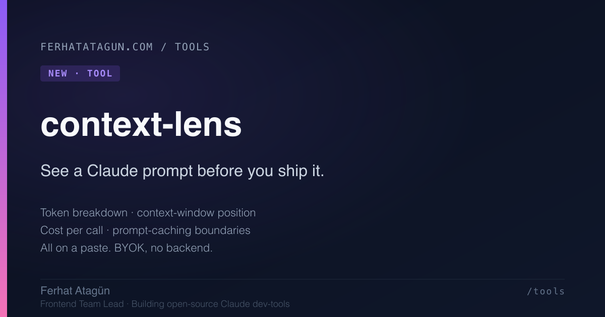

# context-lens

[](LICENSE)
[](https://github.com/ferhatatagun/context-lens/stargazers)
[](#)
[](#)
[](https://context-lens.vercel.app)

**See a Claude prompt before you ship it.**

Paste a system prompt and a user message, see exactly how many tokens
Claude will see, where in the 200K context window you sit, and what
the call will cost on Sonnet, Haiku, or Opus. No backend, no key
required for the heuristic mode, BYOK for the API-accurate count.

**[Live → context-lens.vercel.app](https://context-lens.vercel.app)**



---

## Why

The other tools in this suite tell you what *just* happened with a
Claude call — claudoscope x-rays the response, agent-replay scrubs a
trace, prompt-lab compares two finished runs. None of them tells you
what a prompt looks like *before* you send it.

context-lens is the pre-flight check:

- **How many tokens am I about to send?** Down to the exact count if
  you have an API key (uses the `count_tokens` endpoint), or a fast
  ~3.7-chars/token heuristic if you don't.
- **Where in the context window am I?** A live bar that warns when
  you're near the 200K limit.
- **What will this cost?** Per call and per 1,000 calls, on the model
  tier you select, accounting for whether the input is cache-read.
- **Where would prompt-caching boundaries sit?** Implied by the
  system / message split.

You catch a 4,000-token prompt that should have been 600 *before*
you deploy it to a thousand users. That's the whole pitch.

## What it does

- Two big editable fields — system prompt and user message — with
  live heuristic token counts that update as you type.
- "Count exact (API)" button: calls
  [`/v1/messages/count_tokens`](https://docs.anthropic.com/en/api/messages-count-tokens)
  for the accurate number.
- Model picker (Sonnet 4.5, Haiku 4.5, Opus 4.5) — switches the
  pricing tier and cost estimate.
- Estimated output tokens input — controls the output-side cost.
- "Assume input is cache-read" toggle — flips input pricing from
  `1.0×` to `0.1×` so you can model the steady-state cost of a
  cached prompt vs. its cold start.
- X-ray sidebar: tokens, context-window position, per-call and
  per-1K cost breakdown.
- Suite panel: deep-links to the sibling tools without leaving the
  page.

## How

```bash
git clone https://github.com/ferhatatagun/context-lens
cd context-lens
npm install
npm run dev
# open http://localhost:3000
```

You can use the tool right away with the heuristic count. To get the
exact number from Anthropic, click "Set API key" and paste an
Anthropic key. The key never leaves your browser — it lives in
`localStorage` and goes straight to `api.anthropic.com` with the
`anthropic-dangerous-direct-browser-access: true` header.

## Privacy

- No backend; no server-side telemetry; nothing proxied.
- The API key is stored only in your browser's `localStorage`.
- The `count_tokens` request goes directly to Anthropic.
- Your prompts never leave the page unless you press the
  "Count exact (API)" button — and even then they only go to
  Anthropic's API, not to me.

## Tech

Next.js 16 · React 19 · TypeScript · Tailwind CSS v4 · Framer Motion

## Read the story

The pre-flight angle, and how it fits alongside the post-hoc tools:

- [**What I learned shipping four open-source Claude dev-tools in
  two weekends**](https://ferhatatagun.com/blog/four-tools-in-two-weekends)
  — the meta-narrative on the suite. context-lens is the natural
  extension: pre-flight prompt analysis to complement post-hoc
  observability.

## A small suite

Five tools for seeing what Claude is doing, built together with a
shared design language:

- [claudoscope](https://github.com/ferhatatagun/claudoscope) — x-ray your Claude API calls
- [agent-replay](https://github.com/ferhatatagun/agent-replay) — replay an agent's tool-calling loop
- [prompt-lab](https://github.com/ferhatatagun/prompt-lab) — A/B test prompts side by side
- [tool-lab](https://github.com/ferhatatagun/tool-lab) — interactive tool-use sandbox
- **context-lens** — see a Claude prompt before you ship it *(this one)*

All open source. All MIT. All BYOK where a key is needed.
Source on [github.com/ferhatatagun](https://github.com/ferhatatagun) ·
Long-form posts at [ferhatatagun.com/blog](https://ferhatatagun.com/blog).

## License

MIT — see [LICENSE](LICENSE).
